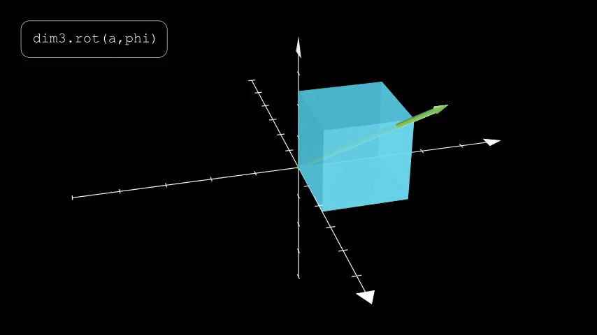

Simple-Transforms API
=====================

Transform Matrix Creation
-------------------------

Translation
"""""""""""

.. py:function:: dim2.trans(d)
.. py:function:: dim3.trans(d)

    Return a pure translation transformation matrix.

    :param d: The translation vector
    :type d: A 2-length or 3-length vector of 2D or 3D translations

    A 3D transformation. The ``d`` argument specifies the translation vector.

Scale
"""""

.. py:function:: dim2.scale(s)
.. py:function:: dim3.scale(s)

    Return a pure scaling transformation matrix.

    :param s: The scale factor or sequence of axis-aligned scale factors
    :type s: A number or 2-length or 3-length sequence of numbers

    A 3D uniform scaling. The ``s`` argument scale factor.

    A 3D non-uniform scaling. The argument is a 3-length vector with components ``sx`` 
    ``sy`` and ``sz`` that define the axis-aligned scale factors.

Rotate
""""""

.. py:function:: dim2.rot(th)

    Return a pure rotation transformation matrix

    :param th: angle

.. py:function:: dim3.rot(a, th)

    Return a pure rotation transformation matrix

    :param a: Axis
    :param th: angle

Reflect
"""""""

.. py:function:: dim2.refl(n)
.. py:function:: dim3.refl(n)

    Return a pure reflection transformation matrix

    :param n: The normal to the line(2D) or plane(3D) of reflection

Skew
""""

.. py:function:: dim2.skew(s)

    :param s: The skew vector

.. py:function:: dim3.skew(n, s)

    :param n: The normal to the skew plane
    :param s: The skew vector

Other
^^^^^

.. todo::
    Add functions to 'recover' to recover the creation parameters from a transformation
    matrix.

Transform Matrix Tools
----------------------

.. todo::
    Add a 'decompose' function to take a general transformation and break it down into
    Rotation + Non-uniform Scaling + Rotation + Translation transformations using
    singular value decomposition

