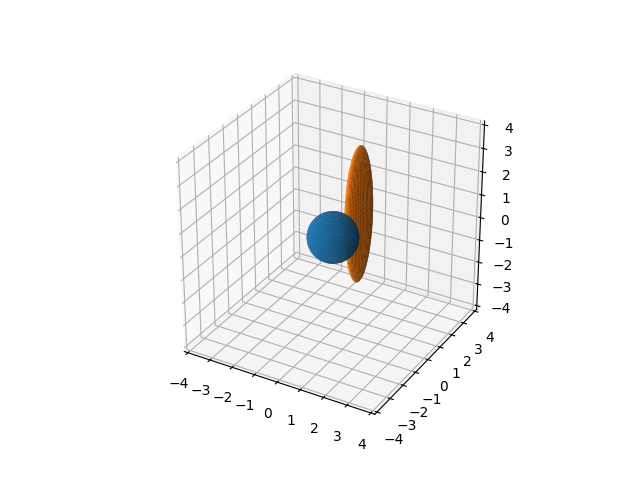

Simple Transforms: Tools for creating geometric transforms as numpy matrices
====================================================================================

Transformation matrices are ways of representing certain useful types of geometric
transforms for 2D and 3D objects. This package provides functions for creating and using
transformation matrices. It does NOT define any new classes, instead it defines creation
functions that return NumPy arrays, and some convenience functions for working with
those NumPy transformation matrices.

.. toctree::
    :maxdepth: 1

    usage
    primer
    api

Example
-------

Here is a quick example of using two 3D transformation matrices to transform a set of
points used to plot a sphere.

.. code-block:: python

    import numpy as np
    from matplotlib import pyplot as plt

    from simple_transforms import dim3 as transforms

    # Make data for a sphere
    u = np.linspace(0, 2 * np.pi, 100)
    v = np.linspace(0, np.pi, 100)
    xa = 1 * np.outer(np.cos(u), np.sin(v))
    ya = 1 * np.outer(np.sin(u), np.sin(v))
    za = 1 * np.outer(np.ones(np.size(u)), np.cos(v))

    # Make a translation, then a non-uniform scale arrays
    move = transforms.trans([0,2,0], dtype=np.float64)
    scale = transforms.scale([0.3,1,3], dtype=np.float64)
    # Combine the transformations to a single transformation
    trans = transforms.combine(move, scale)
    # make an (n,3) array from the x, y, and z coordinates
    a_pts = np.array([xa,ya,za]).T
    # Apply the transformation to the x,y,z points
    b_pts = transforms.apply(trans, a_pts)

    # Create the plot
    fig = plt.figure()
    ax = fig.add_subplot(projection='3d')
    ax.set_xlim(-4, 4)
    ax.set_ylim(-4, 4)
    ax.set_zlim(-4, 4)
    ax.set_aspect('equal')
    # Plot the original un-transformed sphere
    ax.plot_surface(xa, ya, za)
    # Plot the transformed sphere
    xb, yb, zb = b_pts.T
    ax.plot_surface(xb, yb, zb)

    plt.show()

    The orange sphere shows the transformation matrices applied to the points from the
    blue sphere.

Geometric transformations
-------------------------

`geometric transforms <https://en.wikipedia.org/wiki/Geometric_transformation>`_

A geometric transformation is a mapping from a set of points in 3-D coordinate space
onto another set of points in the same 3-D coordinate space. All geometric objects, such
as points, lines, surfaces, solids can all be treated as sets of points. So geometric
transformations correspond to manipulations of geometric objects in 3-D space. 

Linear transformation as matrices
---------------------------------

A point can be represented as a 3 component vector of coordinates (vx, vy, vz).
Matrx multiplication is mapping from 

Affine transformations and homogenous coordinates
-------------------------------------------------

Projection transformations
--------------------------

.. todo::
    Write a primer for linear, affine, and projective transformations as matrices.

